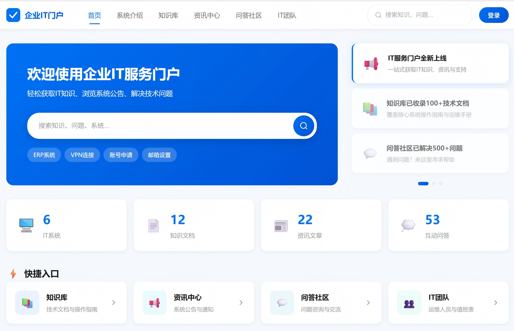
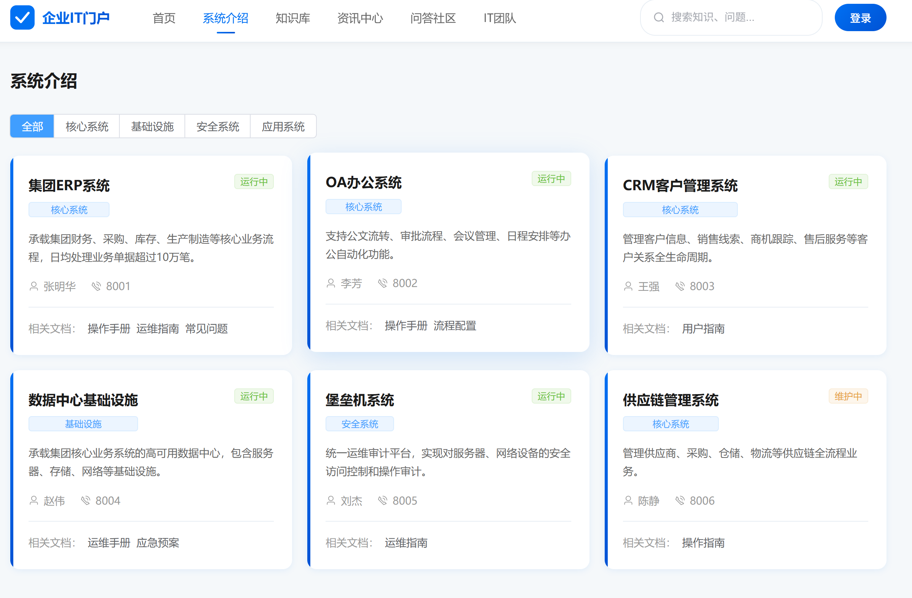
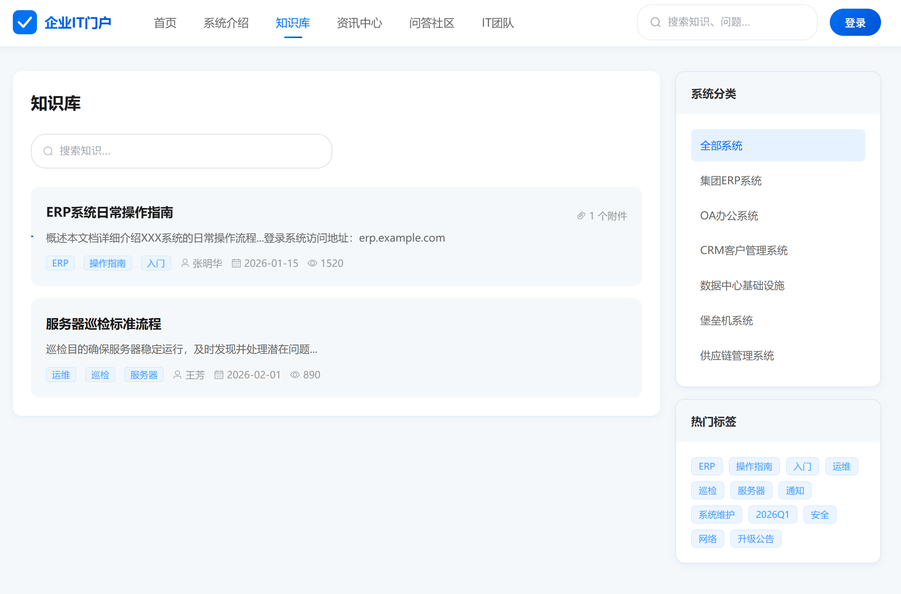
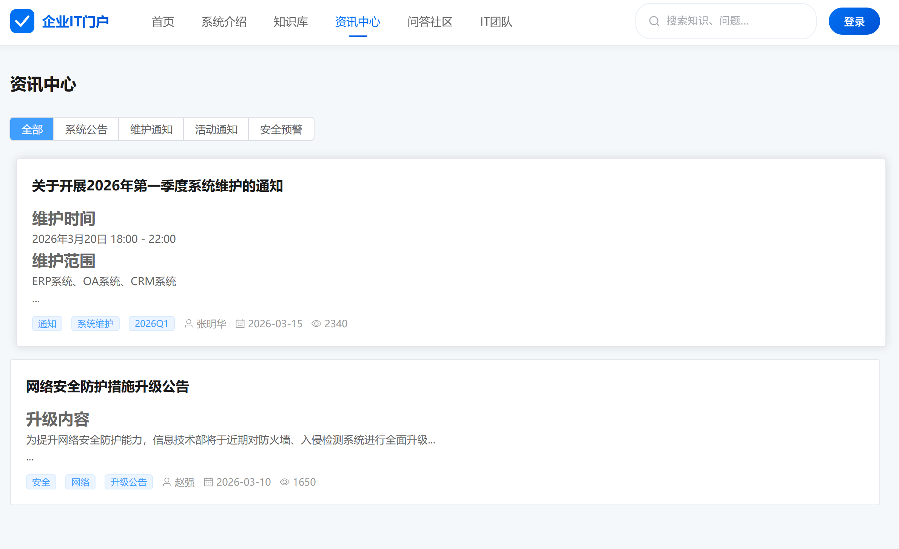
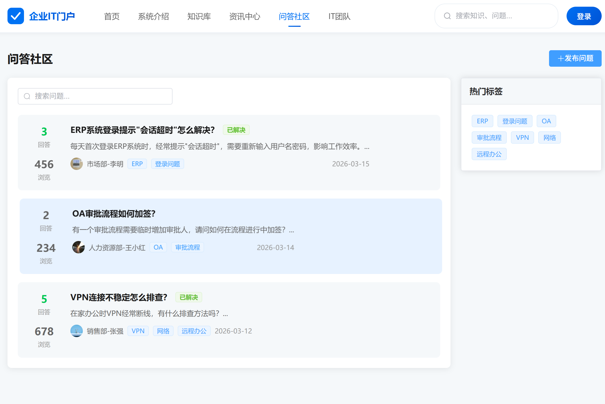
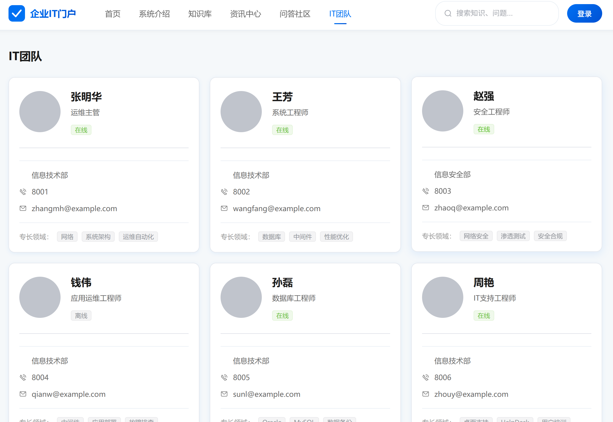
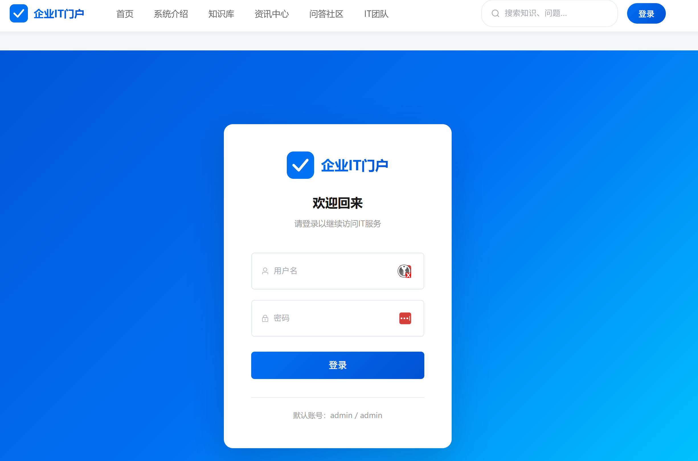

# 企业IT知识门户

企业内部IT系统知识资讯服务的内容发布门户网站，提供知识库管理、资讯发布、问答社区、系统介绍和IT团队展示等功能。

## 界面预览

### 首页


### 系统介绍


### 知识库


### 资讯中心


### 问答社区


### IT团队


### 登录页


## 系统功能

### 1. 首页
- Banner轮播展示重要通知和公告
- 数据统计面板（在线系统、知识文档、资讯、问答数量）
- 快捷入口快速跳转到各模块
- 热门知识、最新资讯、热门问答展示

### 2. 系统介绍
- IT系统分类展示（核心系统、基础设施、安全系统、应用系统）
- 系统详情页（简介、负责人、联系方式、相关文档）
- 系统状态标识（运行中、维护中、已下线）

### 3. 知识库
- 技术文档分类浏览和搜索
- 标签筛选功能
- 富文本编辑器支持图文混排
- 附件上传下载功能
- 点赞和浏览统计

### 4. 资讯中心
- 系统公告、维护通知、安全预警分类
- 富文本文章详情
- 发布时间展示

### 5. 问答社区
- 发布技术问题
- 回答和互动交流
- 答案采纳标记
- 标签分类和搜索

### 6. IT团队
- 运维人员展示（头像、职位、专长）
- 联系方式展示（电话、邮箱）
- 值班表安排

### 7. 管理后台
- 内容管理（知识文档、问答审核）
- 系统管理（增删改查）
- 用户管理（IT人员账号）
- 数据统计面板

## 技术栈

| 类别 | 技术 |
|------|------|
| 框架 | Vue 3 + Composition API |
| 构建工具 | Vite |
| 语言 | TypeScript |
| UI组件库 | Element Plus |
| 富文本编辑器 | wangeditor |
| 路由 | Vue Router |
| 状态管理 | Pinia |
| HTTP客户端 | Axios |

## 项目结构

```
it-knowledge-portal/
├── src/
│   ├── api/              # API接口和Mock数据
│   ├── assets/           # 静态资源
│   ├── components/       # 公共组件
│   │   └── Layout.vue    # 布局组件
│   ├── router/           # 路由配置
│   ├── types/            # TypeScript类型定义
│   ├── views/            # 页面视图
│   │   ├── home/         # 首页
│   │   ├── systems/      # 系统介绍
│   │   ├── knowledge/    # 知识库
│   │   ├── news/         # 资讯中心
│   │   ├── qa/           # 问答社区
│   │   ├── team/         # IT团队
│   │   └── admin/        # 管理后台
│   ├── App.vue
│   └── main.ts
├── public/
├── index.html
├── package.json
├── tsconfig.json
└── vite.config.ts
```

## 项目说明

本项目分为两个部分：

| 目录 | 说明 | 使用场景 |
|------|------|----------|
| `it-knowledge-portal/` | 前端 Vue 3 SPA | 界面展示、用户交互 |
| `it-knowledge-portal-backend/` | 后端 Node.js API | 数据处理、业务逻辑、数据库 |

### 快速部署（Docker，推荐）

```bash
# 克隆项目
git clone https://github.com/lcq225/ITservices.git
cd ITservices

# 启动所有服务（前端 + 后端 + 数据库）
docker-compose up -d

# 访问 http://localhost
```

### 手动部署（前端 + 后端分离）

**前端部署：**
```bash
cd it-knowledge-portal
npm install
npm run dev        # 开发模式 http://localhost:5173
npm run build      # 生产构建
```

**后端部署：**
```bash
cd it-knowledge-portal-backend
npm install
npx prisma generate
npx prisma db push
npx prisma db seed  # 创建测试数据
npm run dev          # 开发模式 http://localhost:3000
```

### 测试账号

| 角色 | 用户名 | 密码 |
|------|--------|------|
| 管理员 | admin | admin123 |
| IT人员 | zhangmh | it123456 |

### 技术栈

#### 前端 (it-knowledge-portal)
| 类别 | 技术 |
|------|------|
| 框架 | Vue 3 + Composition API |
| 构建工具 | Vite |
| 语言 | TypeScript |
| UI组件库 | Element Plus |
| 富文本编辑器 | wangeditor |
| 路由 | Vue Router |
| 状态管理 | Pinia |

#### 后端 (it-knowledge-portal-backend)
| 类别 | 技术 |
|------|------|
| 框架 | Node.js + Express |
| ORM | Prisma |
| 数据库 | PostgreSQL |
| 认证 | JWT |
| 文件上传 | Multer |
| 实时通信 | Socket.IO |
| 安全中间件 | Helmet, Rate Limiting |
| 日志 | Winston |

## 项目结构

```
ITservices/
├── it-knowledge-portal/        # 前端项目
│   ├── src/
│   │   ├── api/              # API 接口
│   │   ├── components/       # 公共组件
│   │   ├── router/           # 路由配置
│   │   ├── stores/           # Pinia 状态管理
│   │   ├── types/           # TypeScript 类型
│   │   ├── utils/           # 工具函数
│   │   │   ├── socket.ts   # WebSocket 客户端
│   │   │   └── search.ts   # 搜索服务
│   │   └── views/           # 页面视图
│   ├── screenshots/          # 界面截图
│   ├── .env.example         # 环境变量模板
│   ├── vite.config.ts       # Vite 配置（含 API 代理）
│   ├── docker-compose.yml   # Docker 编排
│   └── Dockerfile           # 前端 Docker 构建
│
├── it-knowledge-portal-backend/       # 后端项目
│   ├── src/
│   │   ├── controllers/      # 控制器
│   │   ├── middleware/       # 中间件（认证、验证）
│   │   ├── routes/          # 路由
│   │   ├── types/          # 类型定义
│   │   └── index.ts        # 入口文件
│   ├── prisma/
│   │   ├── schema.prisma  # 数据库模型
│   │   └── seed.ts         # 种子数据
│   ├── uploads/            # 文件上传目录
│   ├── .env.example        # 环境变量模板
│   └── Dockerfile          # 后端 Docker 构建
│
├── docker-compose.yml         # 完整服务编排
└── README.md                 # 项目说明文档
```

## 端口说明

| 服务 | 端口 | 访问方式 |
|------|------|----------|
| Nginx | 80 | 浏览器直接访问 |
| Vite Dev | 5173 | 前端开发模式 |
| Node.js API | 3000 | 后端接口 |
| PostgreSQL | 5432 | 数据库（内部） |
| Redis | 6379 | 缓存（内部） |

## API 接口

### 认证接口
- `POST /api/auth/login` - 用户登录
- `GET /api/auth/current` - 获取当前用户

### 业务接口
- `GET/POST /api/articles` - 文章列表/创建
- `GET/PUT/DELETE /api/articles/:id` - 文章详情/更新/删除
- `GET/POST /api/questions` - 问题列表/创建
- `POST /api/questions/:id/answers` - 回答问题
- `GET /api/systems` - 系统列表
- `POST /api/attachments` - 上传附件

## 版本

- **v0.1** - 仅前端版本，包含UI和Mock数据
- **v0.2** - 完整版本，包含前端+后端API+JWT认证+WebSocket
- **v0.3** - 安全增强版，包含Rate Limiting、日志审计、Helmet安全头
- **v0.4** - 依赖修复版，修复 `@types/express-rate-limit` 版本问题，添加 Prisma seed 配置
- **v0.5** - UI升级版，统一图标系统（Element Plus图标）、响应式布局、CSS变量规范化、管理后台样式增强

## License

MIT
